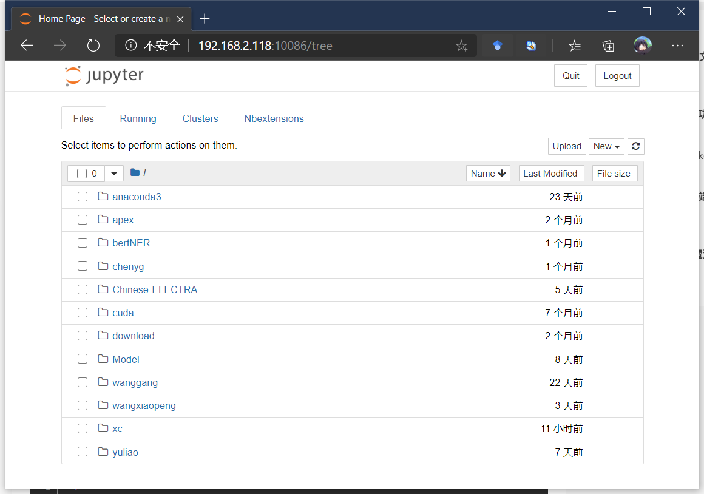

# 借助Proxifier实现内网访问

实验室中有一台电脑可以通过公网ip进行ssh登录，因为服务器只将ssh端口暴露出来所以无法通过ss等需要开放其他端口的方式来构建代理服务器，
本文将利用ssh隧道建立的代理服务器，无需其他软件上的配置，将内网访问请求通过代理服务器进行转发。

## Requirements

- Proxifier Win/Mac
- 内网中拥有公网ip的服务器账号

## 原理

- 利用ssh隧道的socks5代理，使用Proxifier将内网访问请求强制通过代理服务器

## 1. 准备

    需要Proxifier客户端，Win/Mac平台都有对应的客户端，度娘即可

## 2. 建立ssh隧道

### 2.1.  使用ssh命令
> `ssh -D ${本地代理端口} ${用户名}@${公网服务器ip地址} -p ${ssh端口}`

例如

> `ssh -D 1082 bill@202.118.**.** -p 22`


### 2.2.  使用Xshell等ssh客户端
在具有公网ip的服务器连接配置中的`隧道`配置中添加一个Dynamic转移规则


## 3. 配置Proxifier

* 安装好Proxifier后，点击配置文件菜单项中的代理服务器选项
  
  

 在其中配置代理服务器，地址一定为`127.0.0.1`，端口要和之前建立ssh隧道时填写的本地代理端口（Xshell中的侦听端口）保持一致，本文中均设置为了1082

 

* 配置其中的代理规则，孙老师和杨老师的服务器地址在192.168.2.*网段中，我们只需要将这些网段地址中的访问请求通过代理服务器即可。其他地址的服务器代理规则同理。
  
  

* 保存后便可以自动通过代理进行实验室内部服务器资源的访问了，实测支持jupyter vscode ssh ftp

* 使用jupyter时请注意，需要在命令中手动指定ip地址，例如在孙老师服务器上执行

```jupyter notebook --ip 192.168.2.118 --port 10086```

便可以在本地浏览器中通过访问192.168.2.118:10086来使用jupyter



